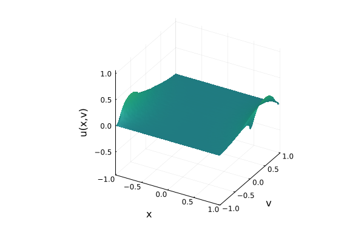

# MonteCarloKFP.jl

Monte Carlo solvers for exit problems associated with Langevin stochastic
processes, whose generator is Fokker-Planck operator.

The repository began as an Apple Metal notebook. It is now being refactored
around a tested, hardware-independent Julia core. CPU execution is the supported
baseline; gpu backends are optional work, not a requirement for using the
numerical model.

## Current status

- Reproducible per-trajectory random streams
- Threaded CPU simulation with early trajectory termination
- Dimension-generic immutable states and simulation results; kinetic states use
  the `(v, x)` layout
- Kinetic Brownian and underdamped Langevin dynamics
- Square, annulus, and two-target absorbing domains
- Direct analytic square, box, concave L-shape, ball, shell, and target domains,
  with classification, measure, sampling, and crossings
- Generic-dimension simulation (2D, 3D, and the 6D `(v, x)` kinetic phase space)
- First-segment boundary intersection, including enter-and-leave steps
- Explicit finite-horizon censoring (`exit_component_indices[i] == 0`)
- Optional thread-safe trajectory progress reporting with ProgressMeter.jl

The original Metal notebook prototype is preserved in Git history, not as a
supported backend. See [GPU backend](docs/gpu-backend.md).

## Quick start

Julia 1.13 or newer is required.

```julia
using Pkg
Pkg.activate(".")
Pkg.test()

using MonteCarloKFP

config = SimulationConfig(
    trajectories = 100_000,
    dt = 1.0f-4,
    max_steps = 200_000,
    seed = 42,
)

result = simulate(
    KineticBrownian(noise=1.0f0),
    AnnulusDomain(2.0f0, 4.0f0),
    (3.0f0, -1.0f0),   # (v, x) phase-space start
    config;
    progress=true,
)

println("exit rate: ", exit_rate(result))
println("inner-boundary probability among exits: ",
        conditional_exit_probability(result, 1))
```

Progress reporting defaults to `false`, which avoids nested bars when `simulate`
is called across a mesh. Pass `progress=true` for the standard bar shown above,
or pass a preconfigured `ProgressMeter.Progress` when custom text, color, or
output is needed.

Start Julia with multiple threads to use the CPU backend in parallel. The former
notebook experiments now live in `examples/` and use a separate plotting
environment. Install that environment once, then run a script:

```bash
julia --project=examples -e 'using Pkg; Pkg.instantiate()'
julia --threads=auto --project=examples examples/annulus_harmonic_measure.jl
```

`Pkg.instantiate()` is required on a fresh checkout. Without it, Julia knows
from `examples/Project.toml` that `Plots` is required but has not yet resolved
and installed it.

See [`examples/README.md`](examples/README.md) for the annulus, square
Dirichlet, and double-well pipelines. Each saves a PNG under the ignored
`examples/artifacts/` directory, which works in a remote/headless workspace.

## Julia environments and dependencies

Julia calls any directory with a `Project.toml` an **environment**; it does not
have to be an installable package with its own `src/` directory. This repository
uses three environments:

- `Project.toml` at the root describes the MonteCarloKFP package and its
  dependency-light numerical core.
- `examples/Project.toml` describes only the optional plotting tools needed by
  the example scripts.
- `dev/Project.toml` pins the formatter and command-line static analyzer used by
  development commands.

`--project=<directory>` selects an environment for one Julia process.
`Pkg.instantiate()` resolves its declared dependencies and downloads missing
packages and binary artifacts into Julia's shared depot, normally `~/.julia/`.
Packages are shared on disk, while dependency selection remains isolated by
environment.

A committed `Manifest.toml` records the exact resolved versions, including
transitive packages and binary artifacts. The root and examples manifests are
versioned for reproducible setup. `Pkg.instantiate()` installs that recorded
resolution; `Pkg.update()` intentionally changes it, so review and commit the
resulting manifest diff. The development manifest is local because tooling
dependencies resolve differently across Julia versions; the tools themselves
remain pinned in `dev/Project.toml`.

```bash
# Prepare and test the package environment.
julia --project=. -e 'using Pkg; Pkg.instantiate(); Pkg.test()'

# Prepare the optional plotting environment.
julia --project=examples -e 'using Pkg; Pkg.instantiate()'

# Inspect or update the plotting environment.
julia --project=examples -e 'using Pkg; Pkg.status()'
julia --project=examples -e 'using Pkg; Pkg.update()'
```

`Plots` is deliberately not listed in the root package dependencies. Julia's
`[extras]` entries are activated for package targets such as tests, and
`[weakdeps]` entries support package extensions; neither makes a dependency
automatically available to standalone example scripts. Making `Plots` a normal
root dependency would install the plotting stack for every package user. A small
separate environment is therefore the standard optional-dependency boundary for
these scripts.



## Repository layout

- `src/`: dependency-light package core
- `test/`: deterministic, simulation, and geometry tests
- `examples/`: script-based experiment and plotting pipelines
- `docs/gpu-backend.md`: current accelerator policy and legacy Metal history

## Important semantics

A simulation has a finite horizon, `dt * max_steps`.
`result.exit_component_indices[i]` is the one-based index into
`boundary_components(domain)` for trajectory `i`; zero means the trajectory did
not exit before the horizon. It does **not** prove that the trajectory never
exits. `exit_probability` counts censored trajectories as failures, whereas
`conditional_exit_probability` conditions on observed exits.

GPU execution is not currently supported; see
[docs/gpu-backend.md](docs/gpu-backend.md).

## Development checks

Julia source uses JuliaFormatter with an 80-column target. Public Markdown uses
Prettier for local formatting and markdownlint for conventions. With Julia,
Node.js 20 or newer, npm, and Make installed, format both with:

```bash
make format
```

The first run installs the pinned development tools. `make quality` performs the
same formatting and Markdown checks as CI without changing files. Package tests
also run Aqua quality checks.

Run the JuliaWorkspaces-based analyzer used by the official Julia VS Code
extension from the terminal with:

```bash
make lint
```

The linter prints source context and fails when it finds warnings. Its shared
editor and CI configuration is in `JuliaLint.toml`.

## License

MIT; see [LICENSE.md](LICENSE.md).
